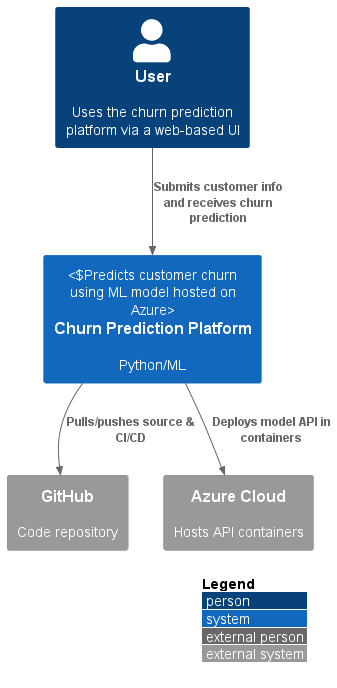
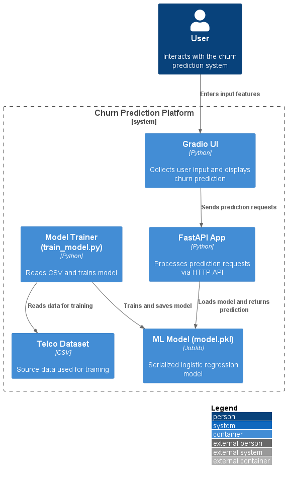
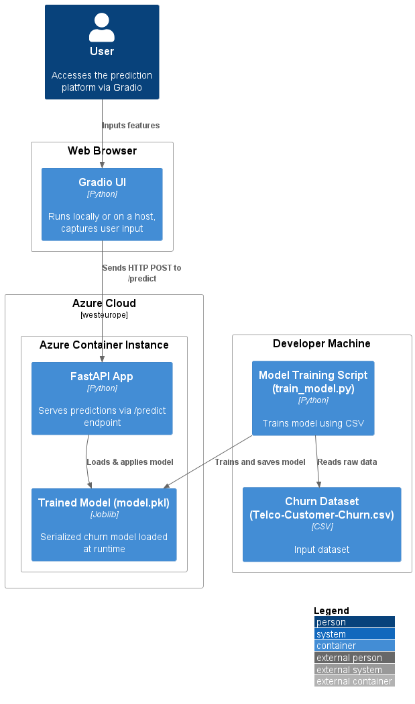
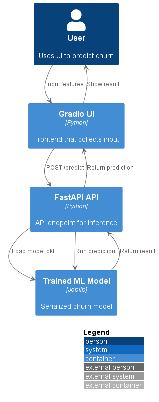

# 🧠 Customer Churn Prediction (End-to-End ML Deployment)
[](https://portal.azure.com/#create/Microsoft.WebSite)


This project demonstrates a full MLOps workflow for predicting customer churn using logistic regression, with a production-ready API deployed to Azure and a live Gradio UI.

---

## 🗂 Project Structure
```
churn-prediction-mlops-azure/
├── data/                   # Telco churn dataset
├── docker/                 # Dockerfile for FastAPI + Gradio
├── notebooks/              # EDA, preprocessing notebooks
├── src/
│   ├── train_model.py      # Train + save pipeline
│   ├── inference/
│   │   ├── app.py          # FastAPI server
│   │   └── pipeline.pkl    # Saved ML pipeline
│   └── ui/
│       └── gradio_ui.py    # Gradio app for testing
├── requirements.txt
├── docker-compose.yml      # Run both FastAPI + Gradio locally
├── README.md
```

## What This Project Demonstrates

- ✅ Data preprocessing and encoding (ColumnTransformer, NaNs, one-hot encoding)
- ✅ Logistic Regression model with pipeline encapsulation
- ✅ MLflow tracking (metrics, parameters, artifacts)
- ✅ Model saved and reused via `joblib`
- ✅ Serving predictions via FastAPI
- ✅ Live Gradio UI for manual testing
- ✅ Dockerized with one Dockerfile, multi-service Compose
- ✅ Deployed to Azure Web App for Containers / Azure Container Instances

---

## 🛠 Architecture Overview (C4 Model)

### 1. System Context


### 2. Container Diagram


### 3. Deployment Diagram


### 4. Sequence Flow


---
## 🚀 Live Demo
👉 API Docs: `http://churnapi21017.westeurope.azurecontainer.io/docs`  
👉 Gradio UI: `http://localhost:7860` *(or hosted Gradio link if deployed)*

---

## 🛠 Tech Stack
- Python 3.12
- scikit-learn, pandas, joblib
- FastAPI, Uvicorn
- Docker, Docker Compose
- Azure CLI + Azure Web App for Containers
- Gradio (UI layer)

---

## ✨ How to Run Locally (via Docker Compose)
```bash
git clone https://github.com/<your-username>/churn-prediction-mlops-azure.git
cd churn-prediction-mlops-azure

# Build and run both FastAPI + Gradio
docker compose up --build
```

- Visit `http://localhost:8000/docs` for API
- Visit `http://localhost:7860` for Gradio UI

---

## 🚤 Deploy to Azure

1. Push Docker image to DockerHub:
```bash
docker build -t yourusername/churn-api:latest .
docker push yourusername/churn-api:latest
```

2. Deploy to Azure Web App:
```bash
az login
az group create --name churn-ml-rg --location westeurope
az appservice plan create --name churn-plan --resource-group churn-ml-rg --is-linux --sku B1
az webapp create --resource-group churn-ml-rg --plan churn-plan \
  --name churn-api-app --deployment-container-image-name yourusername/churn-api:latest
```

---

## Next Steps
- Add Streamlit dashboard (or host Gradio)
- Implement CI/CD via GitHub Actions
- Expose model version via metadata endpoint
- Auto-tag and push Docker builds via GitHub Workflow

---

## Author
**Kene Agbodike**  
_Data & AI | ML Engineering | MLOps | Cloud Deployment_